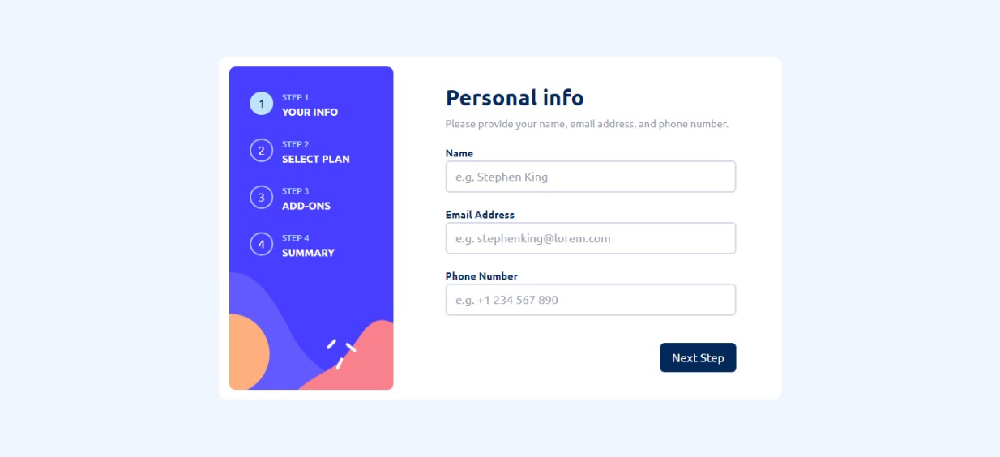

# Plan Subscription App

This is a simple service subscription app with email validation using an API and live payment integration.

### Screenshot

## The App allows users to:

- Enter their personal details
- Select a desired plan
- Select addional subscriptions 
- See a summary of their selections on the final step, before making payment
- Pay / Subscribe to the selected plan.

### Links

- Live Site URL: [View live site](https://plan-subscription.vercel.app)

### Built with

- Mobile-first workflow
- [React](https://reactjs.org/) - JS library
- [Tailwind Css](https://tailwindcss.com/) - Css framework
- [Paystack API](https://paystack.com/developers) - Payment Gateway
- [Abstract API](https://www.abstractapi.com/api/email-verification-validation-api) - Email Validation

## Credits

- [Frontend Mentor](https://www.frontendmentor.io/challenges/multistep-form-YVAnSdqQBJ) - Design
- [Vercel](https://vercel.com) - Hosting (Frontend)
- [Cyclic](https://cyclic.sh) - Hosting (Backend)
